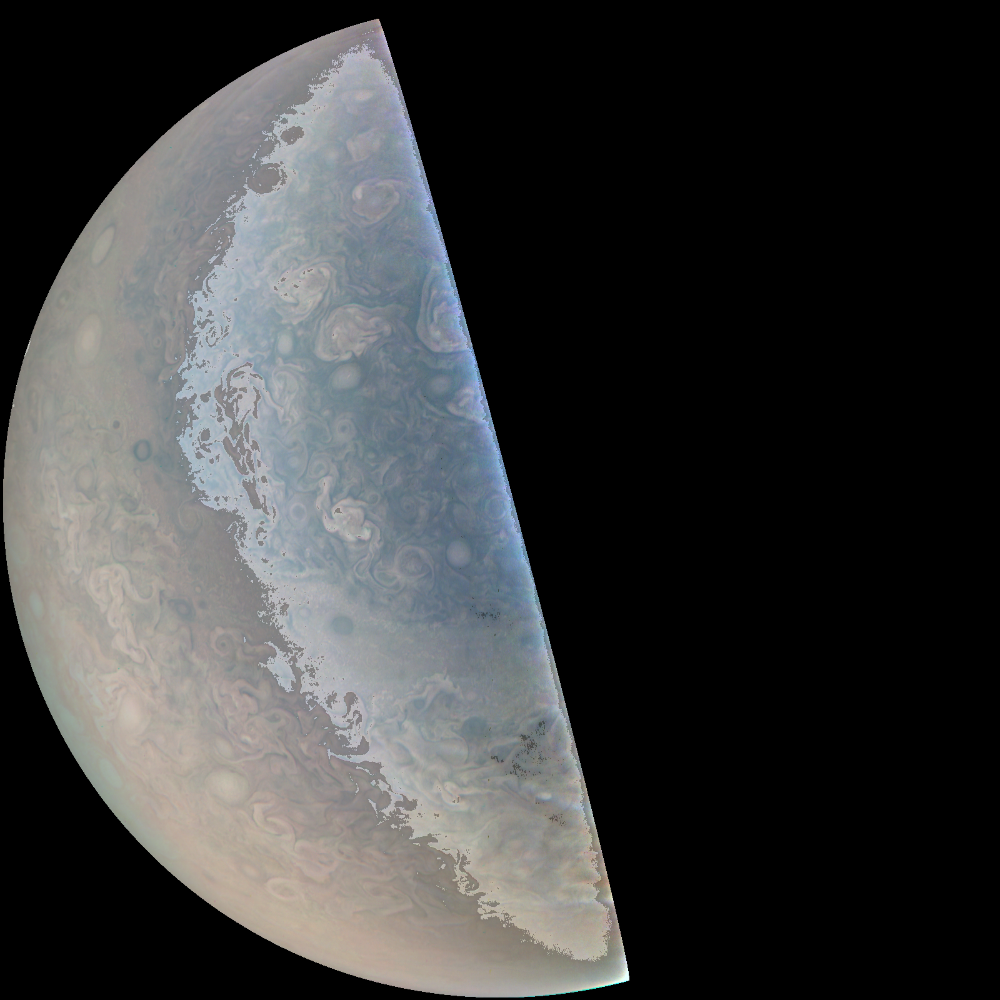
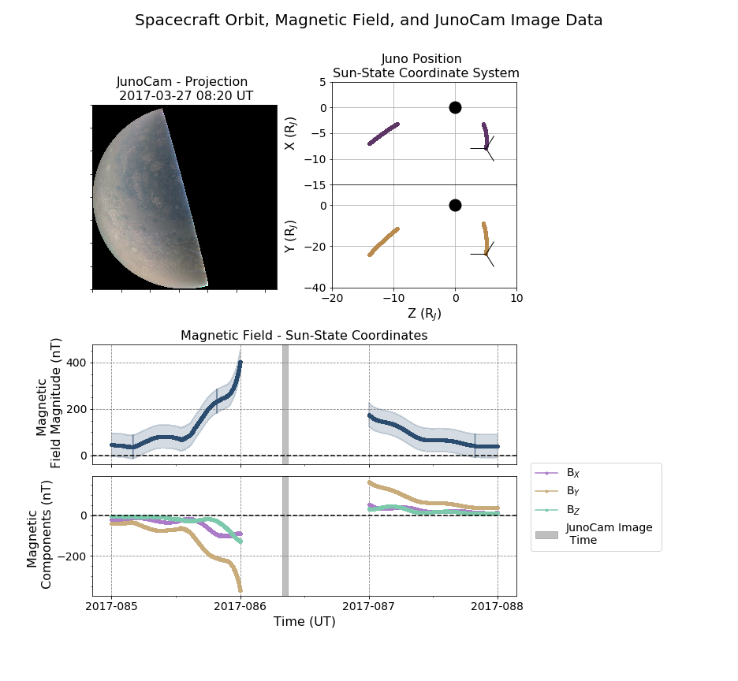
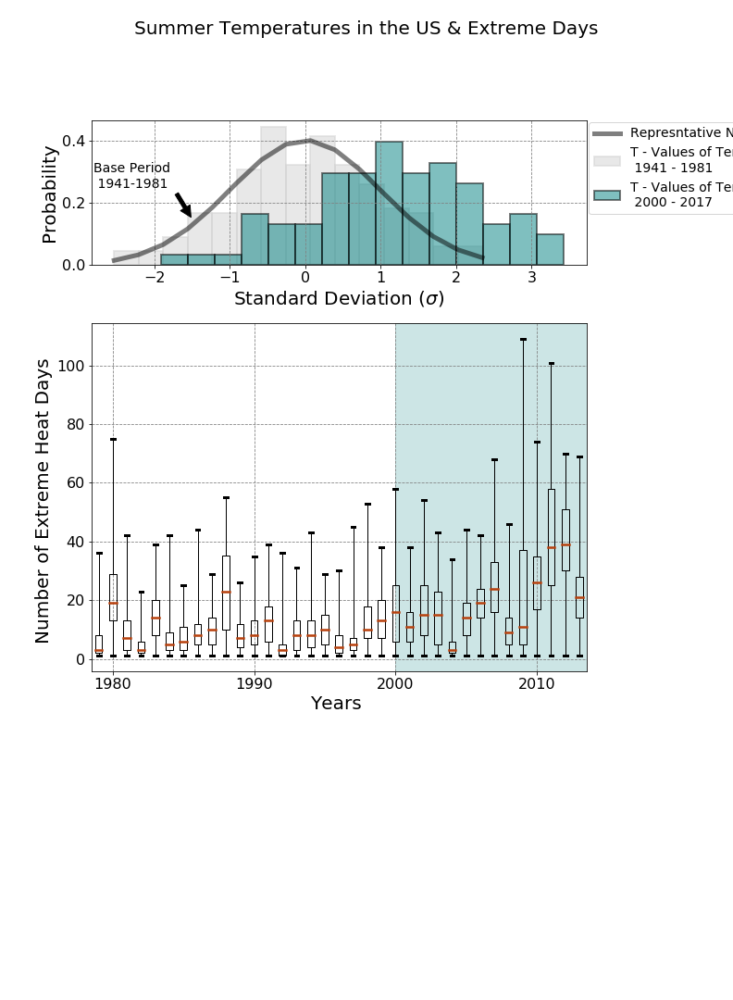
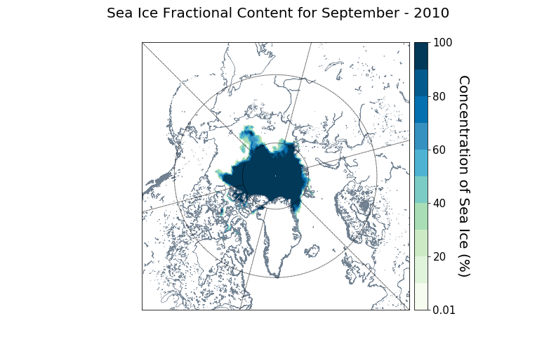
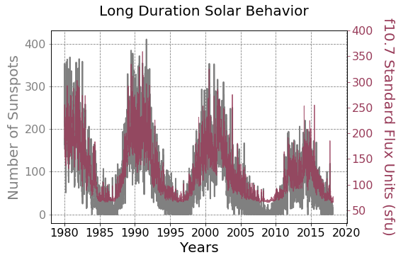

# Data Visualization & Statistics in the Geosciences 2018
This repository contains the laboratory portion of an upper level undergraduate class in Python on data visualization and 
statistics for geo &amp; space scientists. Labs will be updated from January - May at the same cadence as the course (2018). This respository has now been superseeded by the 2019 version of this course! Please refer to the master branch. 

The labs uploaded will be in Jupyter primarily and coded in Python 3.5+. However, most of the functions and methods should work in Python 2.7. If you do not have/know what Jupyter is - you can download Python/Jupyter from Anaconda or Canopy as a fully installed and interactive environment. This will support most if not all of the packages used in the labs and then you can navigate to Jupyter through Anaconda/Canopy.

# Content
### [Lab 1 - Intro to Python - What IS Pandas? (1/10/2018)](https://github.com/astro-abby/data_vis_statistics_geosciences/blob/2018/Lab1/Lab1_ClimaticAverages_GlobalTemperatures.ipynb)
&nbsp;&nbsp;&nbsp;&nbsp;&nbsp;&nbsp; Temperature Changes: Looking at Global Temperature Variances in the Last Century 

### [Lab 2 - Multi-plots and Datetime Objects (1/17/2018)](https://github.com/astro-abby/data_vis_statistics_geosciences/blob/2018/Lab2/Lab2_BirdRanges.ipynb)
&nbsp;&nbsp;&nbsp;&nbsp;&nbsp;&nbsp; Ecosystem Impacts: Looking at Audubon Society Data on Bird Wintering Patterns 

### [Lab 3 - Image Manipulation and Spacecraft Data (1/24/2018)](https://github.com/astro-abby/data_vis_statistics_geosciences/blob/2018/Lab3/Lab3_JupiterFlyBy.ipynb)  
&nbsp;&nbsp;&nbsp;&nbsp;&nbsp;&nbsp; Jupiter Images with Jupyter: Looking at Spacecraft Image Data from the Recent Juno Mission  

### [Lab 4 - Data Merging and Indexing with Spacecraft Data (1/31/2018)](https://github.com/astro-abby/data_vis_statistics_geosciences/blob/2018/Lab4/Lab4_JupiterFlyBy.ipynb)  
&nbsp;&nbsp;&nbsp;&nbsp;&nbsp;&nbsp; Jupiter Data with Jupyter: Looking at Magnetic Field Data from the Recent Juno Mission

&nbsp;&nbsp;&nbsp;&nbsp;&nbsp;&nbsp; Note: For the error analysis section there are eqns written in LaTeX.

&nbsp;&nbsp;&nbsp;&nbsp;&nbsp;&nbsp; They do not show up with Github's preview - if you want to view these please download the Jupyter notebook.  

### [Lab 5 - Groupby, Normal Distributions, & Boxplots (2/7/2018)](https://github.com/astro-abby/data_vis_statistics_geosciences/blob/2018/Lab5/Lab5_NormalsTempsHealthImpacts.ipynb)  
&nbsp;&nbsp;&nbsp;&nbsp;&nbsp;&nbsp; Health Impacts: Normal Distributions of Temperature and Boxplots of Extremes

### [Lab 6 - Linear Regression & Geo-Mapping with Sea Ice (2/14/2018)](https://github.com/astro-abby/data_vis_statistics_geosciences/blob/2018/Lab6/Lab6_MappingSeaIce.ipynb)  
&nbsp;&nbsp;&nbsp;&nbsp;&nbsp;&nbsp; Arctic Indicators: Calculating Rates of Change of Sea Ice Extent & Mapping

&nbsp;&nbsp;&nbsp;&nbsp;&nbsp;&nbsp; Note: The netCDF file required for analysis must be downloaded seperately. 

&nbsp;&nbsp;&nbsp;&nbsp;&nbsp;&nbsp; You can find the gridded ice concentration data from the [National Snow & Ice Data Center](http://nsidc.org/data/G10010).

&nbsp;&nbsp;&nbsp;&nbsp;&nbsp;&nbsp; Additionally this lab is dependent on the Python packages for [netCDF-4](http://unidata.github.io/netcdf4-python/) and [Basemap](https://matplotlib.org/basemap/).

### [Lab 7 - Correlation Coefficients, Classification Problems, & Space Weather (3/7/2018)](https://github.com/astro-abby/data_vis_statistics_geosciences/blob/2018/Lab7/Lab7_SpaceWeatherClassifiers.ipynb)  
&nbsp;&nbsp;&nbsp;&nbsp;&nbsp;&nbsp; Space Weather: Solar Impacts on Geomagnetic Storms

### [Lab 8 - Object Oriented Programming and Bootstrap Analysis (3/14/2018)](https://github.com/astro-abby/data_vis_statistics_geosciences/blob/2018/Lab8/Lab8_SpaceWeatherBootstraps.ipynb)  
&nbsp;&nbsp;&nbsp;&nbsp;&nbsp;&nbsp; Space Weather: Linear Regression with Bootstrap Analysis

### [Data Visualization Basics (5/16/2018)](https://github.com/astro-abby/data_vis_statistics_geosciences/blob/2018/VisualizationBasics/Visualization_Basics.pdf)  
&nbsp;&nbsp;&nbsp;&nbsp;&nbsp;&nbsp; Adapted for the [ICOS Big Data Summer Camp](https://github.com/ICOSBigDataCamp/2018-summer-camp) at University of Michigan

| | |
|:-------------------------:|:-------------------------:|
|Lab 1  | Lab 2  
|Lab 3  | Lab 4  
|Lab 5  | Lab 6  
|Lab 7  |Lab 8 

This README will be updated to reflect current changes. Data used in the lessons will be accredited to the providers. Lab assignments are availiable and will be mentioned in the tutorials but are not linked. 

This class has been developed in collaboration with [Dr. Michael Liemohn](http://clasp.engin.umich.edu/people/liemohn) of the Climate & Space Sciences & Engineering department. 

Discussions with climate scientist [Samantha Basile](http://clasp.engin.umich.edu/people/sjbasile/GSTUDENT) were critical in developing these materials. We also thank planetary scientist [Camilla Harris](https://github.com/cdkharris) for discussions of Juno data, Gabriel Harp the Research Director of ArtsEngin at University of Michigan for pointing us toward climate health impact data, space scientist [Doga Ozturk](http://clasp.engin.umich.edu/people/dcsoztrk/GSTUDENT) for expertise in space weather informatics, solar physicist [Yeimy Rivera](http://clasp.engin.umich.edu/people/yrivera/GSTUDENT) for expertise in solar surface data, and Jeff Lockhart of the [Computational Social Scientists](https://github.com/UM-CSS) (CSS) for offering resources through CSS.

Last update 5/29/2018

# License
The content and lessons of this repository itself is licensed under the [Creative Commons Attribution-Non Commercial 4.0 license](https://creativecommons.org/licenses/by-nc/4.0/). However, the specific code used within the notebooks taken out of context and to format and display that content is licensed under the [MIT license](https://choosealicense.com/licenses/mit/).
